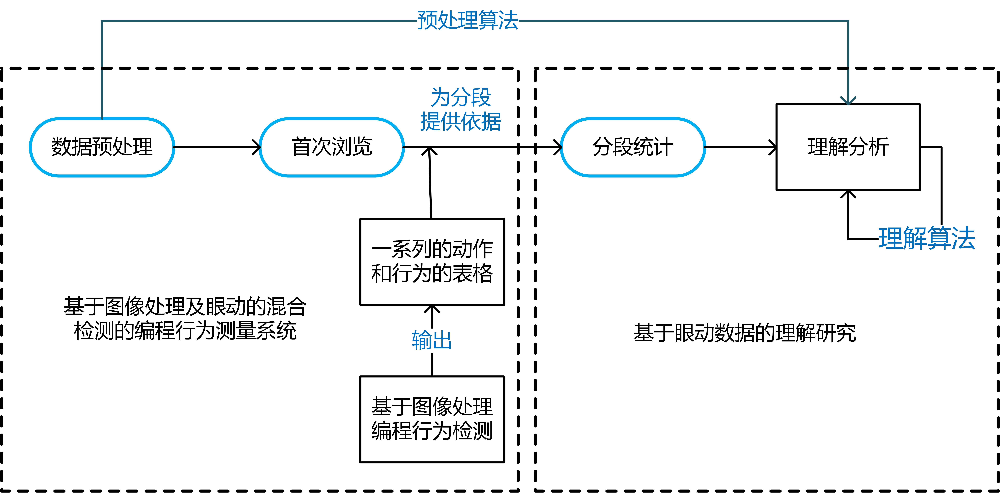
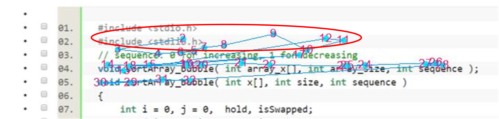

# 毕设要求

### 一、学硕：实现某个过程的识别（有理论基础）

#### 1.1 目标：

1. 构造出自动分段的算法，每段与解题的意图相对应，然后进行分类
2. 从标记好的分段中，匹配出浏览过程，然后进行分析

####1.2  工作基础：

​	本学期，对于已有的眼动数据能够做到精确地切割、描述、组装、拆分

（例如：现在有多少数据，根据现有的判别方式能够切割成多少片，将其标记好，然后采取某种设置方式能够迅速找到相应的样本进行相应的处理，开发一个数据处理的平台）

###二、专硕：自然编程环境中的编程解析系统（有技术系统）

#### 2.1 需求：

​	一个不占用CPU资源的录屏软件

#### 2.2 编程环境：

​	codeblocks

#### 2.3 目标：

1. 对于录制视屏分割出的每帧图片
2. 能动态识别代码编辑区域
3. 能识别行号
4. 能识别编译器的编译错误提示（codeblocks行号后面会有一个红色块状提示）

# 目前眼动数据处理工作

### 任务

1. 数据预处理
2. 首次浏览识别
3. 分段处理

### 方案

1. 现有的阅读轨迹只考虑了y轴和时间t，可以加入x轴（行）的信息。由于三维坐标在二维平面画不出来，所以可以将x方向上的分块，转换成y方向上的分块y1,y2,y3，横向视线的变化可以用纵向的跳转。

2. 基于语义进行(xing)行(hang)矫正

​	如图所示红色圈中的视线点所在的位置没有意义，结合上下文，离这些点最近的AOI应该是第三行，所以视线点2、7 、 8 、 9、 11、 12应该被归到第三行。